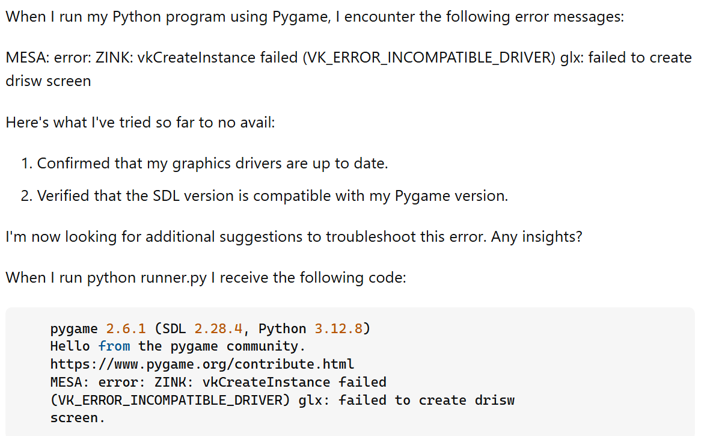

## Introduction

When looking for help in an online forum, it is important to be able to ask the right questions in order to get an appropriate and helpful response. The following are some guidelines from [Eric S. Raymond](http://www.catb.org/esr/faqs/smart-questions.html#before) on how to ask a smart question. The question header should be specific and meaningful, not open-ended, it should be clear that you have done your research, the subject matter should describe the symptoms of your problem chronologically, and it should include what you are trying to do. In the next two sections I will discuss two examples of queries made in the StackOverflow forum that I think showcase good and bad examples of smart questions.

## [Good Example](https://stackoverflow.com/questions/72789012/why-does-vkcreateinstance-return-vk-error-incompatible-driver-on-macos-despite)

In this question by user "Chribit", they are asking for help with resolving an incompatible driver error with vulkan. The question header includes the error and troubleshooting steps they have already taken. In their subject matter they explain the steps they took, they say that the executable works on their PC but not their Macbook, they provide the relevant code they are using to create a vulkan instance, and they describe the problem which is the executable doesn't create a vulkan instance. 
This is a smart question because the user outlines what specific issue they are having and provides details about their hardware system, operating system, and their C++ code. The subject matter shows that the user has attempted to fix the problem themselves through steps like confirming their GPU is compatible. They also describe the steps they took chronologically which can be helpful to solving the problem. 
The responses also reflect the smartness of this question. The responses are able to narrow down the cause to be a change in a newer version of SDK. Then the respondent gives specific steps on how to resolve the issue. 
The responses were effective because the user described the steps they took. They say that the program functions on their Windows system but not their Mac so the issue is probably due to the operating system and not the code.

## [Bad Example](https://stackoverflow.com/questions/79394250/pygame-error-zink-vkcreateinstance-failed-vk-error-incompatible-driver-need)

In this question, the user asks for troubleshooting help with an incompatible driver error with vulkan. The question is open-ended and not specific because they are asking for next steps they can take to troubleshoot the problem. In the subject matter, they don't provide much details about what program they are running, their operating system, and other relevant information. The only information they provide is the output they get which is unnecessary as their question already contains the error they are getting. They don't describe the chronological steps they have taken, just a list of solutions they have attempted. 
The responses are correspondingly not helpful to solving the user's problem. The responses illustrate the need to provide code for users to replicate the problem and to better understand the issue. One of the respondents asks for more information such as operating system and graphics driver. If the user provided those details they might have gotten more helpful information on what their issue might be.

## Conclusions

Analyzing these two questions helped me understand the importance of doing your own research as well as being concise and detailed in the specific problem that you have. If you do research by yourself, you get an understanding of the kind of specific kind of question/issue you have. This allows you to provide more relevant and concise information which will help you get more helpful answers. In addition, if you convey the solutions you've attempted and the steps you've taken, it will narrow it down for other users which will also get a better answer. 
