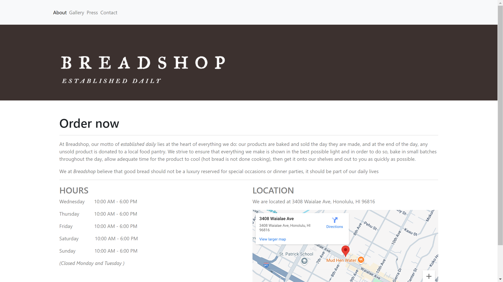
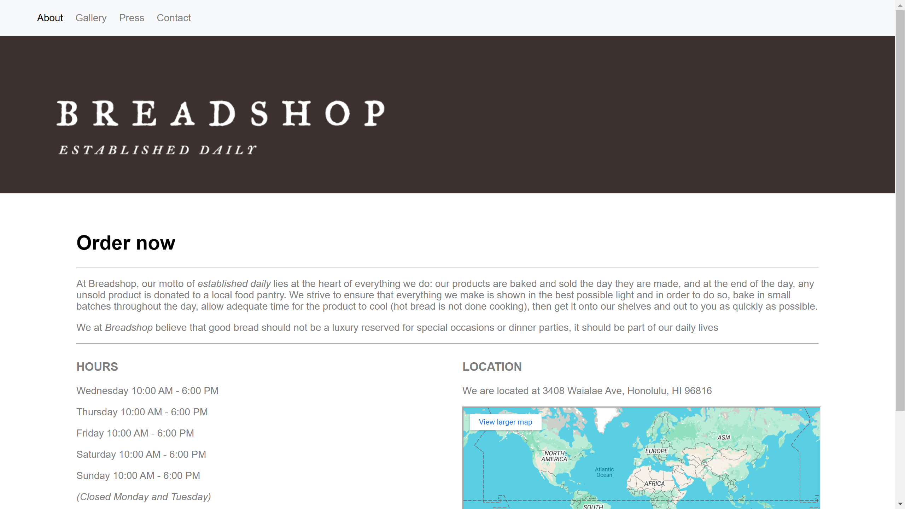

## Why Use UI Design Frameworks

Websites made with HTML can often be made with just the HTML programming language and the style sheet language Cascading Style Sheets(CSS). Further functionality can be incorporated using scripting langauges such as JavaScript. However, website developers might also opt to use UI design frameworks which include libraries and components helpful in creating a user interface. Some examples of UI design frameworks are Bootstrap, SemanticUI, and React. These frameworks provide libraries and components that are useful in making things such as navigation bars, grids, input fields, menus, and more. This is useful as user interface components can be reused removing the hassle of rewriting .html and .css code for those components. Some of these UI design frameworks are also made to provide functionality for different devices and screens such as Bootstrap whose libraries are designed for the mobile screen size. However, learning to use one of these frameworks is also an investment, time that could be used to learn how to create the same functionality in just HTML and CSS. Despite this, I think it is worth it to learn how to use these frameworks as it can save time and frustration when designing a website.

## Breadshop with and without Bootstrap

   Bootstrap Version
   
   Without Bootstrap Version

 

The above images are my attempts at recreating Kaimuki Breadshop's website. One was made with the help of Bootstrap and the other with just HTML and CSS. One of the biggest differences between the two was the .css stylesheet portion. The stylesheet for the Bootstrap version was much shorter than the without Bootstrap version because I was writing classes for each portion of the website in the without Bootstrap version. In the end the navigation bar, logo, schedule, and location portion each had at least one class that was mainly used to format the website. Something else that wasn't implemented in this recreation was things like menus which would be a lot easier to do with Bootstrap since they offer library support for designing menus. The main difference was the time spent writing the stylesheet and debugging to make it look like the actual website. All in all, I found Bootstrap easier to work with for this specific task, I expect these benefits will be even more apparent when making user interface elements since that is what Bootstrap's primary support is for.
