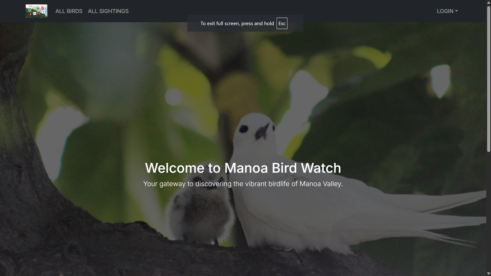
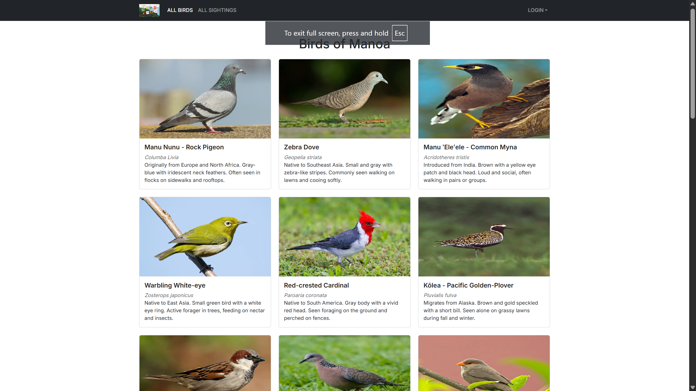

Manoa Bird Watch is a website designed for bird watchers on Manoa campus to report sightings of birds and their locations in order to build up a catalogue of birds and their sightings. This will help prospective bird watchers find the birds they are looking for and also let them contribute their sightings to help fellow bird watchers in their ventures. I worked on the database for the website, register and login pages, and the pages which lists the sightings that have been reported. For the database, I worked with Vercel to publish the website and oversaw changes to the database coordinating with my teammates needs. Through this project, I learned how to balance my workload with the additional requirements that my teammates asked of me to ensure a timely development cycle. I also learned about managing databases hosted on cloud platforms like Vercel. This project helped me develop my software engineering skills by working on a website geared towards the ongoers of Manoa.

<a href="https://m1-jeffrey8193s-projects.vercel.app/">Manoa Bird Watch</a>
<a href="https://github.com/manoa-bird-watch/manoa-bird-watch-app">GitHub</a>

