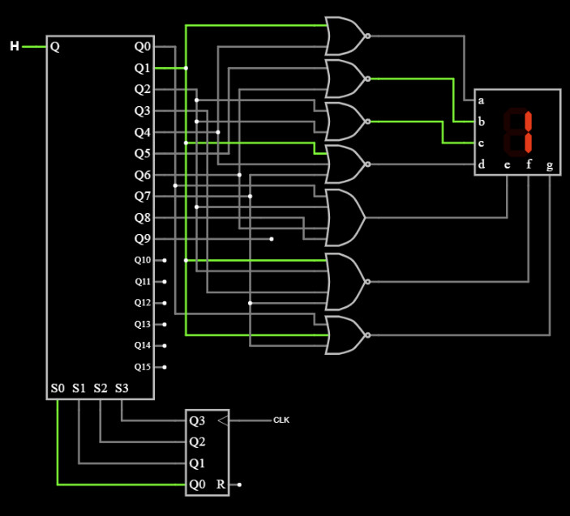

Verilog is a hardware description language (HDL) that models electronic systems, it is often used to design digital circuits. For this project, I designed a circuit that would display a scrolling text on multiple 7 segment displays. The specific phrase that was chosen for this demonstration was "ALOHA" because each letter is representable in a 7 segment display. After designing the circuit I utilized Verilog to verify that the circuit functions correctly and fix any mistakes made in circuit design. This project combined skills from ECE 260 such as circuit design, knowledge of electronic systems, and logic, with coding prowess with HDLs like Verilog. The following is the design for the 7 segment display, this design was referenced when implementing the Verilog code:

