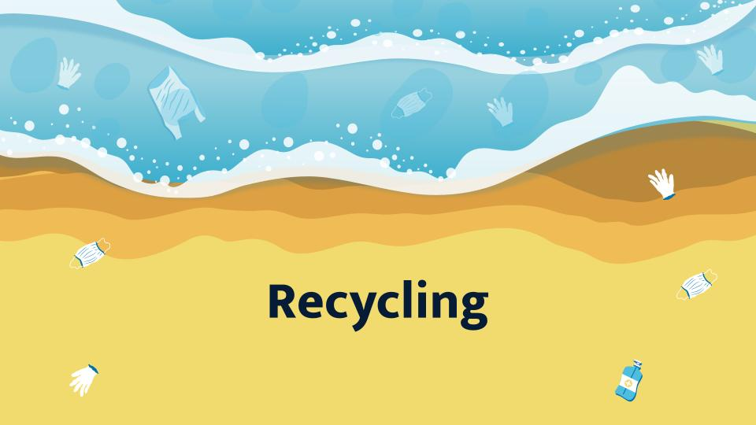
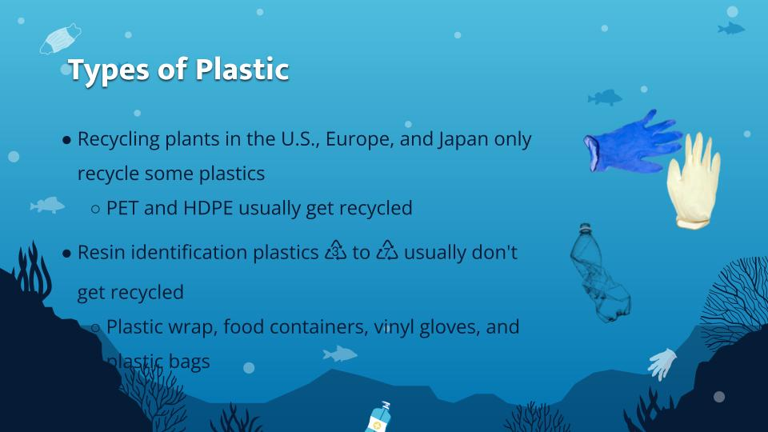
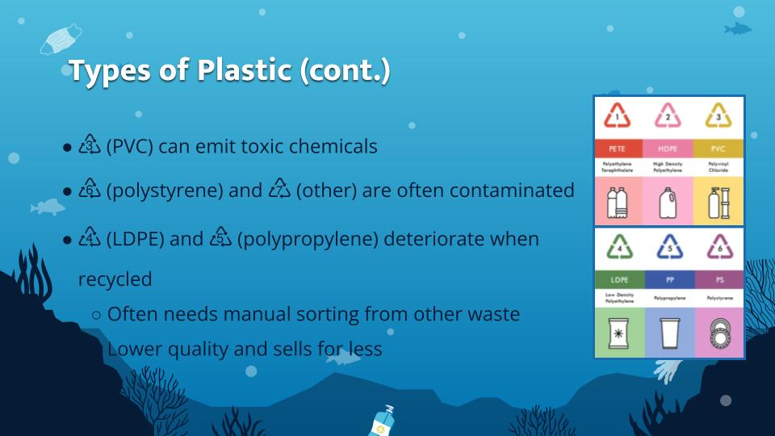
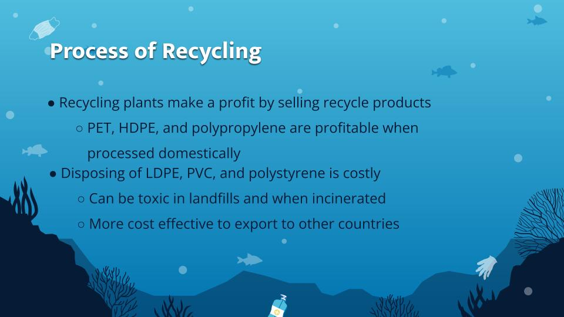
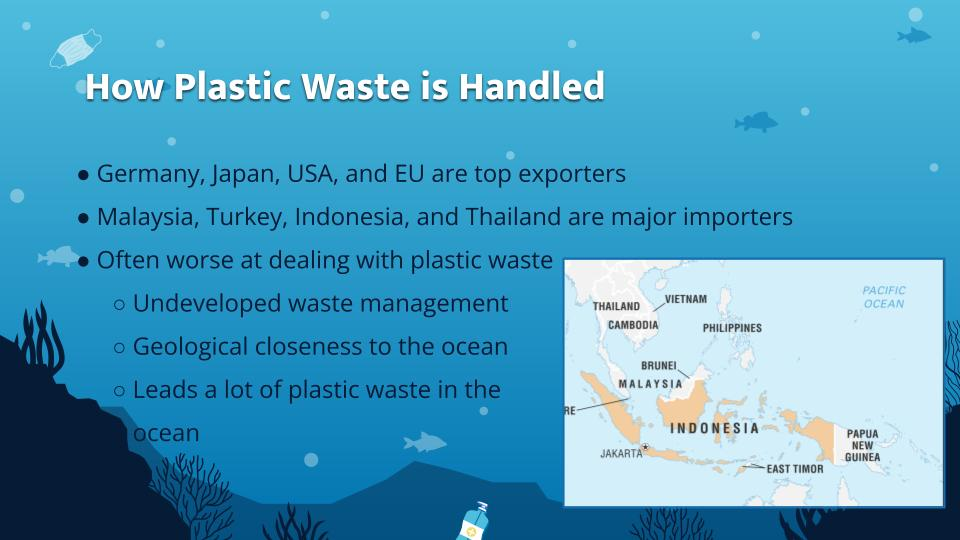

For the final week of SUST 342 me and my group members researched about the Great Pacific Garbage Patch (GPGP), what kind of garbage and how it ends up there. Furthermore, we used concepts from politics ecology, such as the theory of the Capitalocene, to study capitalism, and how it's the driving factor on the waste, fishing, and recycling industry which are major contributors to the GPGP. In my portion of the presentation, I talked about eco-friendly technology being implemented to address garbage issues like the GPGP. For example, I presented research about Japan's plastic incineration and how it both contributes to energy production while also keeping garbage out of the oceans. The following is an excerpt of the presentation discussing the recycling industry:

